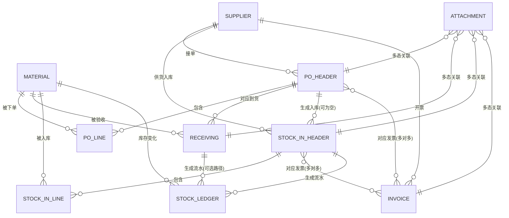

# P2 数据库设计：ER 关系说明 + 字段字典 + 待确认表设计

> 本文档只做设计，不处理任何原始数据。8月发票校验总表.xlsx、7月发票PDF等新出现的P2原始文件，
> 会在你确认这份设计之后，作为独立的"扫描与清洗"阶段单独处理（见《P2_清洗与匹配规则.md》）。

---

## 一、ER 关系说明

### 1.1 八张正式表的关系（文字版，先看这个）

- **物料主数据 / 供应商 / 分类字典**（P1 已完成）是 P2 全部单据的字典源头，P2 不重建这三张表，只引用。
- **采购单主表** 是一张"单头"，一个供应商一次下单一条记录；挂在它下面的是**采购单明细表**（一种物料一行）。
- **到货验收表** 记录实际到货时的核对结果，对应到"某个采购单里的某个SKU"这个粒度（不是对应到明细行ID，因为同一SKU可能分几次到货）。
- **入库单主表** 对应"海底捞内部系统"里正式过账的那张单——它可能来自一个采购单（外部采购入库），也可能不来自任何采购单（总仓配送、店内自制、盘点盘盈），所以"采购单ID"这个字段允许为空。入库单下面挂**入库单明细表**。
- **发票表** 记录供应商开来的发票，一张发票可能对应多个采购单/入库单（合并开票），一个采购单也可能对应多张发票（分批开票）——这是多对多关系。
- **附件表** 是所有图片/PDF的统一存放登记表，不管这个附件是采购截图、到货照片、入库单扫描件还是发票，都在这一张表里登记，用"所属业务类型+所属业务记录ID"这两个字段反查它属于哪张业务单据的哪一条记录（这种设计叫"多态关联"，好处是以后不管再加多少种新单据类型，附件表结构都不用变）。
- **库存流水表** 是全系统库存变化的唯一真相来源——不管是采购入库、总仓配送、店内生产、领用消耗、报损、盘点差异，任何库存数字的变化都必须落一条流水，物料的"当前库存"永远是流水的汇总结果，不能被任何单据直接改写。

### 1.2 ER 图（Mermaid，支持渲染的工具可直接看图；纯文本环境请看下方"关联矩阵"）

### 1.3 关联矩阵（精确外键，纯文本版）

| 从表 | 字段 | 到表 | 基数 | 说明 |
|---|---|---|---|---|
| 采购单主表 | 供应商ID | 供应商 | N:1 | 一张采购单一个供应商 |
| 采购单明细表 | 采购单ID | 采购单主表 | N:1 | 单头-明细 |
| 采购单明细表 | SKU | 物料主数据 | N:1 | 明细行对应的物料 |
| 到货验收表 | 采购单ID | 采购单主表 | N:1 | 到货对应哪张采购单 |
| 到货验收表 | SKU | 物料主数据 | N:1 | 到货的具体物料（同一采购单可多次到货同一物料，因此不是唯一约束） |
| 入库单主表 | 采购单ID | 采购单主表 | N:0..1 | 可为空（总仓配送/自制/盘盈等非外部采购入库） |
| 入库单主表 | 供应商 | 供应商 | N:0..1 | 可为空（自制/盘盈无供应商） |
| 入库单主表 | 发票ID | 发票表 | N:0..1 | 允许为空，发票可能晚到 |
| 入库单明细表 | 入库单ID | 入库单主表 | N:1 | 单头-明细 |
| 入库单明细表 | SKU | 物料主数据 | N:1 | 入库的具体物料 |
| 发票表 | 供应商 | 供应商 | N:1 | 开票方 |
| 发票表 | 对应采购单 | 采购单主表 | N:N | 一票可能对应多单，一单也可能分多票 |
| 发票表 | 对应入库单 | 入库单主表 | N:N | 同上 |
| 附件表 | 所属业务记录ID | (多态：采购单主表/到货验收表/入库单主表/发票表/其他) | N:1 | 由"所属业务类型"决定具体指向哪张表 |
| 库存流水表 | SKU | 物料主数据 | N:1 | 库存归集键 |
| 库存流水表 | 关联采购单 | 采购单主表 | N:0..1 | 采购入库类流水才有 |
| 库存流水表 | 关联入库单 | 入库单主表 | N:0..1 | 入库类流水才有 |

---

## 二、字段字典（8张表，字段口径完全按你上一条消息给出的清单，逐一补充类型/说明/关联目标）

> 图例同 P1：🔗关联记录 　🔍查找引用　Σ公式/汇总　🔢自动编号　⬜普通字段

### A. 采购单主表 `tbl_po_header`

| 字段 | 飞书字段类型 | 说明 |
|---|---|---|
| 采购单ID | 🔢/⬜ 自动编号或稳定文本 | 系统内部永久主键，一旦生成不再变化 |
| 采购单号 | ⬜ 公式（日期+序号） | 对外展示用单号，如 `PO-20260810-003` |
| 叫货日期 | ⬜ 日期 | |
| 预计到货日期 | ⬜ 日期 | |
| 实际到货日期 | ⬜ 日期 | 可能晚于预计日期，也可能因分批到货而对应多条"到货验收" |
| 供应商ID | 🔗 关联记录 → 供应商 | |
| 供应商名称 | 🔍 查找引用（供应商→供应商名称） | 冗余字段，避免每次都要跳转查看 |
| 门店/仓库 | ⬜ 单选 | 目前只有 AU6D 一家门店，先固定一个选项，为将来多店预留字段 |
| 采购状态 | ⬜ 单选（状态机） | 草稿/已下单/部分到货/已到货/已入库/已开票/已付款/已关闭 |
| 采购总金额 | Σ 汇总（采购单明细表·金额） | |
| 税额 | Σ 汇总（采购单明细表·税额） | |
| 含税金额 | ⬜ 公式（总金额+税额） | |
| 创建人 | ⬜ 人员 | |
| 备注 | ⬜ 多行文本 | |
| 来源文件 / 来源Sheet / 原始行号 | ⬜ 单行文本 | 数据迁移追溯用，正式手工下单以后新增的单据这三个字段可留空 |
| 创建时间 / 更新时间 | ⬜ 创建时间/修改时间（飞书系统字段） | |

### B. 采购单明细表 `tbl_po_line`

| 字段 | 飞书字段类型 | 说明 |
|---|---|---|
| 采购明细ID | 🔢 自动编号 | |
| 采购单ID | 🔗 关联记录 → 采购单主表 | |
| SKU | 🔗 关联记录 → 物料主数据 | **只有匹配置信度达标才允许关联，否则先落在"待确认"表，见下方P2待确认表设计** |
| 原始物料名称 | ⬜ 单行文本 | 原始单据/Excel里怎么写就怎么存，不因为匹配到了SKU就删掉 |
| 标准物料名称 | 🔍 查找引用（SKU→物料名称） | |
| 叫货数量 | ⬜ 数字 | |
| 叫货单位 | ⬜ 单选 | 原始下单用的单位（箱/包/件…） |
| 标准单位 | 🔍 查找引用（SKU→单位） | 物料主数据里的库存最小单位 |
| 单位换算系数 | ⬜ 数字 | 叫货单位 → 标准单位的换算比例；P1阶段物料主数据里这个字段大多是空的，需要在P2清洗时逐步补 |
| 单价 | ⬜ 货币 | 不含税单价 |
| 金额 | ⬜ 公式（数量×单价） | |
| 税率 | ⬜ 数字（%） | |
| 含税金额 | ⬜ 公式 | |
| 实收数量 | Σ 汇总（到货验收表） | |
| 差异数量 | ⬜ 公式（叫货-实收） | |
| 差异原因 | ⬜ 单选 | 短装/超收/破损/临期/错货/无 |
| 数据匹配置信度 | ⬜ 单选（高/中/低/无） | 见清洗规则文档"物料匹配优先级" |
| 是否待人工确认 | ⬜ 单选（是/否） | |

### C. 到货验收表 `tbl_receiving`

| 字段 | 飞书字段类型 | 说明 |
|---|---|---|
| 验收单ID | 🔢 自动编号 | |
| 采购单ID | 🔗 关联记录 → 采购单主表 | |
| 到货日期与时间 | ⬜ 日期时间 | |
| 验收人 | ⬜ 人员 | |
| SKU | 🔗 关联记录 → 物料主数据 | |
| 叫货数量 | 🔍 查找引用（对应采购单明细） | |
| 实收数量 | ⬜ 数字 | |
| 拒收数量 | ⬜ 数字 | |
| 缺货数量 | ⬜ 公式（叫货-实收-拒收，不含赠品） | |
| 赠品数量 | ⬜ 数字 | 供应商额外赠送，不计入采购金额但计入库存 |
| 质量状态 | ⬜ 单选 | 合格/部分合格/拒收 |
| 差异原因 | ⬜ 单选 | 同采购明细表口径，保持一致 |
| 图片附件 | 🔗 关联记录 → 附件表 | 不直接挂附件字段，统一走附件表登记（见下方"附件表"设计理由） |
| 备注 | ⬜ 多行文本 | |

### D. 入库单主表 `tbl_stock_in_header`

| 字段 | 飞书字段类型 | 说明 |
|---|---|---|
| 入库单ID | 🔢 自动编号 | |
| 入库单号 | ⬜ 公式 | |
| 海底捞系统单号 | ⬜ 单行文本 | 内部系统里的单号，供对照 |
| 入库日期 | ⬜ 日期 | |
| 供应商 | 🔗 关联记录 → 供应商（可为空） | |
| 仓库/门店 | ⬜ 单选 | |
| 入库类型 | ⬜ 单选 | 采购入库/总仓配送入库/店内生产入库/调拨入库/盘盈入库/退货入库 |
| 单据状态 | ⬜ 单选 | 待入库/已入库/已核对/异常 |
| 总金额 | Σ 汇总（入库单明细表·金额） | |
| 操作人 | ⬜ 人员 | |
| 审核人 | ⬜ 人员 | |
| PDF/图片附件 | 🔗 关联记录 → 附件表 | |
| 海底捞系统跳转链接 | ⬜ URL | 如果内部系统支持直接生成链接 |
| 采购单ID | 🔗 关联记录 → 采购单主表（可为空） | |
| 发票ID | 🔗 关联记录 → 发票表（可为空，可多选） | |
| 备注 | ⬜ 多行文本 | |

### E. 入库单明细表 `tbl_stock_in_line`

| 字段 | 飞书字段类型 | 说明 |
|---|---|---|
| 入库单ID | 🔗 关联记录 → 入库单主表 | |
| 入库明细ID | 🔢 自动编号 | |
| SKU | 🔗 关联记录 → 物料主数据 | |
| 物料名称 | 🔍 查找引用 | |
| 批次 | ⬜ 单行文本 | |
| 生产日期 | ⬜ 日期 | |
| 有效期 | ⬜ 日期 | |
| 数量 | ⬜ 数字 | |
| 单位 | 🔍 查找引用（SKU→单位） | |
| 单价 | ⬜ 货币 | |
| 金额 | ⬜ 公式 | |
| 税额 | ⬜ 数字 | |
| 含税金额 | ⬜ 公式 | |
| 库位 | ⬜ 单选 | 门店/大库/外租仓，与 P1 供应商类型概念呼应 |
| 备注 | ⬜ 多行文本 | |

### F. 发票表 `tbl_invoice`

| 字段 | 飞书字段类型 | 说明 |
|---|---|---|
| 发票ID | 🔢 自动编号 | |
| 发票号码 | ⬜ 单行文本 | |
| 发票代码 | ⬜ 单行文本 | |
| 开票日期 | ⬜ 日期 | |
| 供应商 | 🔗 关联记录 → 供应商 | |
| 购方名称 | ⬜ 单行文本 | 通常固定是"AU6D"门店的法定抬头，但保留字段用于核对 |
| 未税金额 | ⬜ 货币 | |
| 税额 | ⬜ 货币 | |
| 含税金额 | ⬜ 货币 | |
| 发票类型 | ⬜ 单选 | 增值税发票/普通收据/其他（视澳洲Tax Invoice规范调整） |
| 发票状态 | ⬜ 单选 | 待核验/一致/有差异/已确认 |
| 对应采购单 | 🔗 关联记录（可多）→ 采购单主表 | |
| 对应入库单 | 🔗 关联记录（可多）→ 入库单主表 | |
| PDF附件 / 图片附件 | 🔗 关联记录 → 附件表 | |
| 查验状态 | ⬜ 单选 | 未查验/已查验一致/已查验有差异 |
| 备注 | ⬜ 多行文本 | |

### G. 附件表 `tbl_attachment`（统一附件登记，不分散挂在各业务表里）

| 字段 | 飞书字段类型 | 说明 |
|---|---|---|
| 附件ID | 🔢 自动编号 | |
| 文件名称 | ⬜ 单行文本 | |
| 文件类型 | ⬜ 单选 | PDF/图片/其他 |
| 文件地址 | ⬜ 附件字段（飞书原生）或 URL | 定制网页系统上线后，这里存网页系统里的对象存储地址；P2初期先用飞书原生附件字段 |
| 文件大小 | ⬜ 数字（KB） | |
| 上传时间 | ⬜ 创建时间 | |
| 上传人 | ⬜ 人员 | |
| 所属业务类型 | ⬜ 单选 | 采购单/到货照片/入库单/发票/海底捞系统回单/退货单/其他 |
| 所属业务记录ID | ⬜ 单行文本 | 配合"所属业务类型"反查具体是哪张表的哪一条记录（多态关联，飞书原生不支持"跨表任意关联"，这个字段先做文本存ID，配合网页系统做真正的可点击跳转，见《系统架构文档》） |
| 文件说明 | ⬜ 单行文本 | |
| 是否原始凭证 | ⬜ 复选框 | 区分"原始扫描件"和"后期整理的复印/汇总件" |
| 文件哈希/去重标识 | ⬜ 单行文本 | 建议用文件内容的MD5/SHA1，同一张发票被重复上传两次时可以识别 |

### H. 库存流水表 `tbl_stock_ledger`

| 字段 | 飞书字段类型 | 说明 |
|---|---|---|
| 流水ID | 🔢 自动编号 | |
| 业务日期 | ⬜ 日期 | |
| SKU | 🔗 关联记录 → 物料主数据 | |
| 仓库/门店 | ⬜ 单选 | |
| 库位 | ⬜ 单选 | |
| 业务类型 | ⬜ 单选 | 采购入库/总仓配送入库/店内生产入库/领用出库/销售消耗/报损出库/退货出库/调拨入库/调拨出库/盘盈/盘亏/库存调整 |
| 业务单号 | ⬜ 单行文本 | |
| 入库数量 | ⬜ 数字 | |
| 出库数量 | ⬜ 数字 | |
| 调整数量 | ⬜ 数字（带正负号） | |
| 结存数量 | Σ 公式（滚动结余） | |
| 单位成本 | ⬜ 货币 | |
| 流水金额 | ⬜ 公式 | |
| 批次 | ⬜ 单行文本 | |
| 供应商 | 🔗 关联记录 → 供应商（可为空） | |
| 关联采购单 | 🔗 关联记录 → 采购单主表（可为空） | |
| 关联入库单 | 🔗 关联记录 → 入库单主表（可为空） | |
| 操作人 | ⬜ 人员 | |
| 来源 | ⬜ 单行文本 | 记录这条流水是被哪个自动化/哪张单据触发生成的 |
| 备注 | ⬜ 多行文本 | |

> **关键设计强调（对应你的"叫货数量"与"实际消耗数量"必须分离）**：
> "叫货数量"只存在于 **采购单明细表**；"实收数量"存在于 **到货验收表 / 入库单明细表**；
> "领用出库/销售消耗"数量存在于 **库存流水表**（业务类型=领用出库/销售消耗）。
> 三者是三套独立记录，永远不会互相覆盖，趋势图各自取各自的表。

---

## 三、P2 待确认表设计

与 P1 完全同一套思路：**任何模糊匹配都只生成建议，不直接写入正式表**，写入"待确认"表由人工确认后再回填（复用 P1 已经跑通的"确认包+回填脚本"模式，P2 会新增一版 `P2_人工确认与回填包.xlsx` 和对应回填脚本，字段结构在扫描完实际文件后另行设计，此处先定基本框架）。

| 待确认表 | 用途 | 核心字段（初步） |
|---|---|---|
| 采购单物料匹配_待确认 | 采购单明细里的物料名称匹配不到P1现有SKU，或匹配置信度不够高 | 原始物料名称、原始单据来源、候选SKU(可多个)、匹配依据、置信度、最终确认SKU |
| 采购单供应商匹配_待确认 | 采购单/发票上的供应商名称匹配不到P1现有供应商 | 原始供应商文本、候选供应商ID、匹配依据、置信度、最终确认供应商ID |
| 单位换算_待确认 | 叫货单位与库存标准单位之间缺换算系数，或换算结果与历史经验不符 | SKU、叫货单位、标准单位、系统推算系数(如有)、置信度、最终确认系数 |
| 数量差异_待确认 | 叫货数量 vs 实收数量 vs 入库数量 vs 发票数量，任意两者不一致且没有对应的"差异原因"记录 | 采购单ID、SKU、各环节数量、差异金额、疑似原因、最终处理方式 |
| 单据关联_待确认 | 一票多单/多票一单/入库单找不到对应采购单等情况 | 涉及单据编号列表、疑似关系、置信度、最终确认关系 |
| 重复导入_待确认 | 同一张发票/入库单疑似被重复导入（文件哈希重复或单号重复） | 附件哈希、涉及记录ID列表、最终处理方式(保留其一/都保留但标记) |

这些表的详细字段会在**扫描完你实际的P2原始文件之后**（8月发票校验总表、发票PDF等）按照实际发现的问题类型精确设计，不在此提前假设具体内容——这一点和《P2_清洗与匹配规则.md》里"先扫描、后清洗、等确认"的原则一致。
